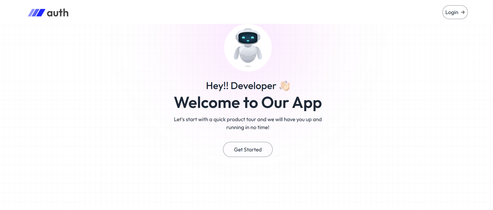
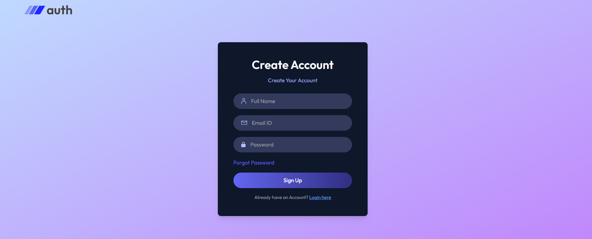
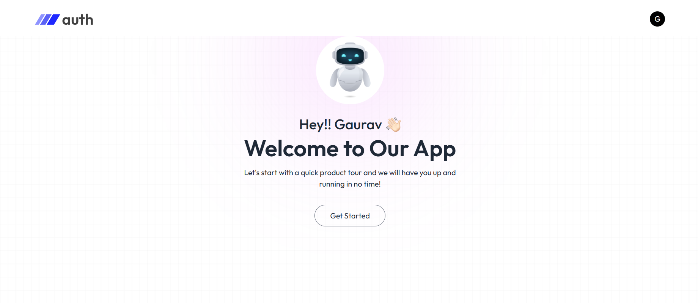

# 🚀 MERN Gmail Authentication App

A modern **MERN stack authentication** application that allows users to **sign up, log in, and authenticate via Gmail**.  
The app features a clean UI, smooth UX, and secure authentication flow using **JWT** and **OAuth 2.0**.

---

## 🌟 Features

- 🔐 **Gmail OAuth Authentication**
- 🧑‍💻 **User Signup & Login**
- 🔁 **Session Management with JWT**
- ⚡ **MERN Stack (MongoDB, Express, React, Node.js)**
- 🎨 **Modern & Responsive UI**

---

## 🖼️ Screenshots

### 👋 Welcome Screen

### 🧍 Sign Up Page

### ✅ Logged-In Dashboard

---

## ⚙️ Tech Stack

| Technology | Description |
|-------------|-------------|
| **MongoDB** | Database for storing user info |
| **Express.js** | Backend framework |
| **React.js** | Frontend framework |
| **Node.js** | Server runtime |
| **JWT** | Secure authentication tokens |
| **OAuth 2.0** | Google Sign-In integration |

---

## 🚀 Getting Started

